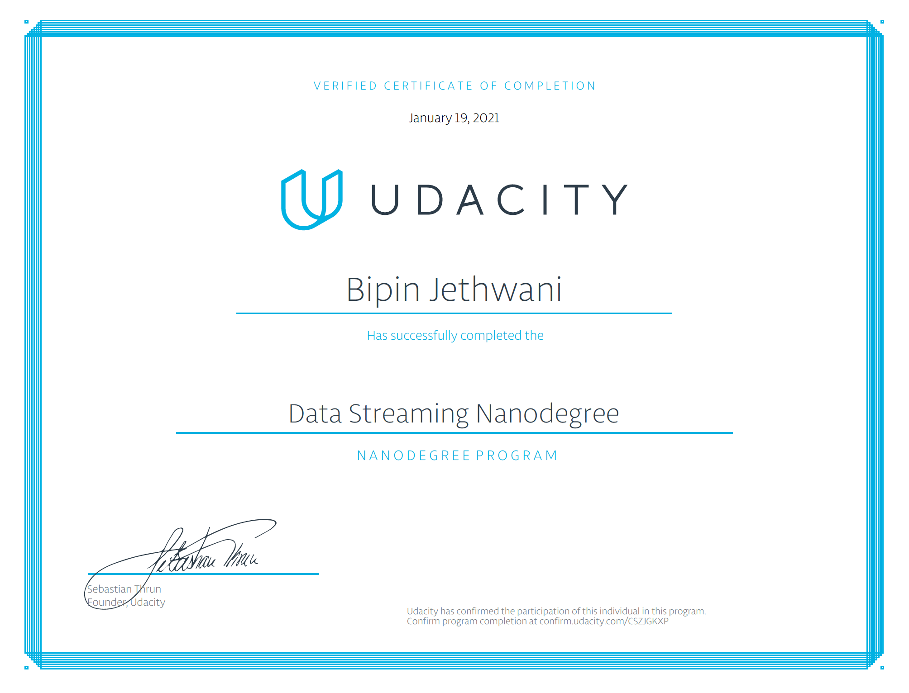

# udacity_sf_crimes

Provide statistical analyses of the data using Apache Spark Structured Streaming

How did changing values on the SparkSession property parameters affect the throughput and latency of the data?

maxRatePerPartition: This worked when I increaded the number of topic partitions 
maxOffsetsPerTrigger: This improved the throughput.
spark.sql.shuffle.partitions

spark.executor.memory 
spark.executor.cores
spark.driver.memory 
numInputRecords
inputRowsPerSecond 
processedRowsPerSecond

What were the 2-3 most efficient SparkSession property key/value pairs? Through testing multiple variations on values, how can you tell these were the most optimal?

maxRatePerPartition : 100
maxOffsetsPerTrigger: 100
spark.sql.shuffle.partitions: 100